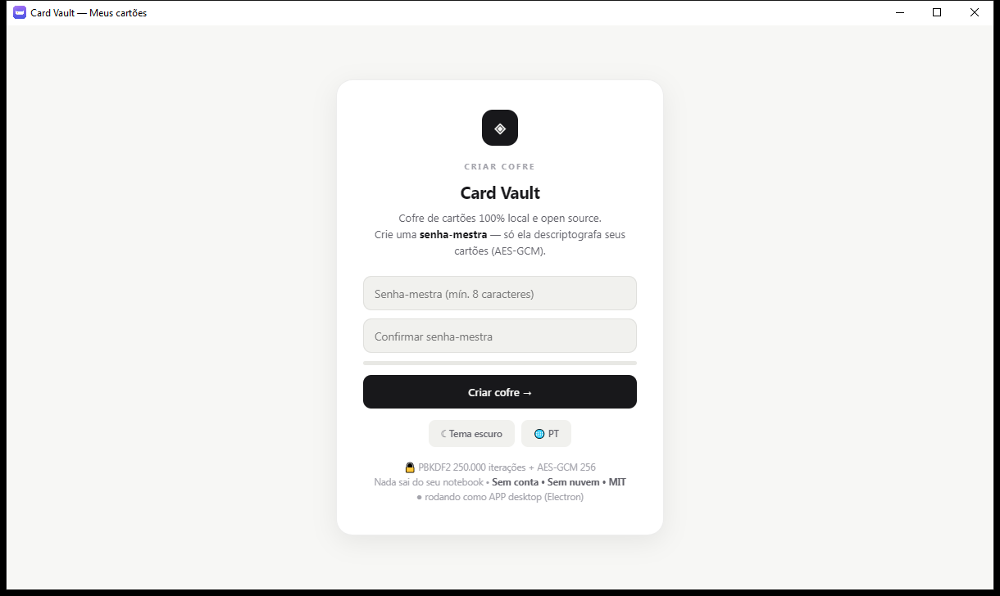
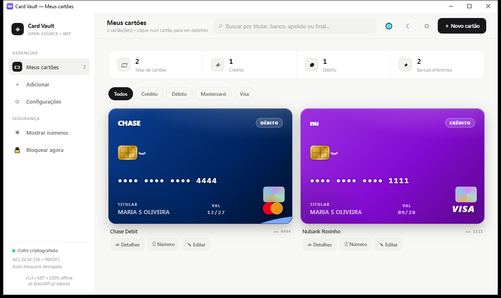

# ◈ Card Vault — Cofre de Cartões Open Source

> 🌐 **Site oficial:** https://eliene-byte.github.io/card-vault/ — para ativar: GitHub → repo **Settings → Pages → Deploy from a branch → `main` → `/docs` → Save (leva ~1 min).

   

**100% gratuito • open source MIT • offline-first • PT/EN/ES.** Guarde seus cartões com visual fiel ao banco, bandeira auto-detectada e validação total (número Luhn + tamanho por bandeira, CVV por bandeira, validade) — tudo cifrado com **AES-GCM 256 + PBKDF2 250.000 iterações**. Nada sai do seu aparelho.

| Tela de acesso | Cofre |
|---|---|
|  |  |

## ⬇ Baixar

| Plataforma | Arquivo | Como instalar |
|---|---|---|
| **Windows (notebook)** | `Card-Vault-1.4.0-x64.exe` (portable, sem instalar) | Baixe em [Releases](../../releases) e dê duplo clique — nenhum terminal abre |
| **Windows (instalador)** | `Card-Vault-Setup-1.4.0-x64.exe` | Próxima release com instalador NSIS (ou rode `npm run dist:setup`) |
| **Linux** | `Card-Vault-1.4.0-x64.AppImage` / `.deb` | Via CI em [Releases](../../releases) (ou `npx electron-builder --linux AppImage deb`) |
| **Celular Android (.APK)** | `card-vault-debug.apk` | Baixe em [Releases](../../releases) — gerado grátis pelo GitHub Actions a cada versão |
| **Celular (PWA)** | `card-vault-pwa.zip` | Também em [Releases](../../releases): hospede em qualquer https e toque em *Adicionar à tela inicial* (iPhone: Safari → Compartilhar) |

> **Como os 3 são gerados:** cada tag `v*` (ex: `v1.4.0`) dispara o workflow [.github/workflows/build.yml](.github/workflows/build.yml), que compila **Windows + Linux + APK + PWA** nas máquinas do GitHub e publica tudo na Release. Para compilar o APK no seu PC, veja [docs/APK.md](docs/APK.md) (requer Android Studio).

## ✨ Recursos

- 💳 **Cartões fiéis aos bancos reais** — Nubank, Inter, Itaú, Bradesco, Santander, BB, Caixa + top 34 bancos do mundo (Chase, HSBC, Revolut…) com logo, padrão e relevo
- 🏦 **Todos os bancos do mundo**: BrasilAPI (350+ BR, grátis sem chave) + **GLEIF ao vivo** (base global oficial, grátis sem chave) + lista mundial offline
- 🔍 **Busca unificada** por nome, código ou país (🇧🇷🇺🇸🇪🇺🇯🇵…)
- ✅ **Validação 100% segura**: Luhn + tamanho por bandeira (Visa, Mastercard, Amex 15, Diners 14, Elo, Hipercard, Discover, JCB, Aura, UnionPay), CVV por bandeira (Amex 4), validade (vencido/futuro absurdo barrados), alerta de número de teste
- 🔄 **Verso do cartão em 3D** (tarja + CVV com revelar temporário), **ordenar** (recentes/A–Z/banco/vencimento), **alerta de vencimento** (⚠ 3 meses), **copiar ficha completa**, animações spring 60fps
- 🔒 **Login com senha-mestra** sempre ao abrir + **throttling anti-força-bruta** (atraso progressivo + shake), auto-bloqueio, clipboard auto-limpa, CVV/número ocultos com revelar temporário
- 🌐 **PT / EN / ES** com 1 clique (🌐 no topo, na tela de login e nas Configurações)
- 🎨 **Ultra clean minimalista**, modo claro/escuro, animações spring 60fps, atalhos (`/` busca, `Esc` fecha)

## 🔐 Segurança (resumo sênior)

- Vault: `AES-GCM 256`, chave derivada via `PBKDF2-SHA256 250k` — só existe descriptografado na RAM; `Bloquear` zera tudo
- Rede: **apenas** listas públicas de bancos (BrasilAPI + GLEIF). Cartões nunca saem do aparelho
- Sem conta, sem nuvem, sem tracker, sem telemetria

## 🛠 Rodar do código

```bash
npm install
npm run dev            # vite http://localhost:5173 (PWA em dist/)
node build/make-icon.mjs
call sync-dist.cmd && npx electron-builder --win portable --x64
```

APK: [docs/APK.md](docs/APK.md) • Ícones: `node build/make-icon.mjs`

## 🤝 Contribuir

PRs são bem-vindos! Padrão: 1 arquivo (`index.html`), zero dependências no runtime, tudo traduzido nas 3 línguas.
